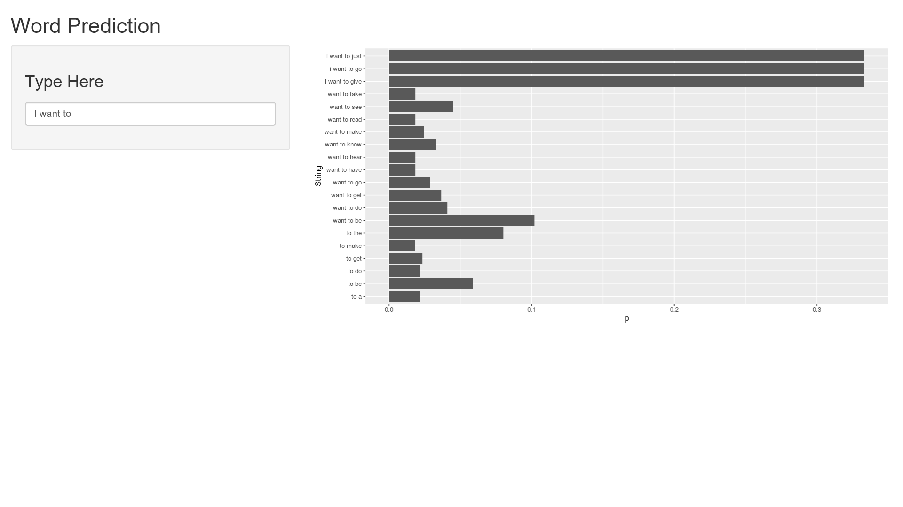

Final Presentation
========================================================
author: John Klapp
date: 27 Jan 2020
autosize: true

Algorithm Description
========================================================

The objective of this project is to develop a word prediction algorithm. 

- This implementation starts with processing text from news articles, blogs and twitter, and using those to build a dictionary of word combinations. A 10% sample of that was used due to keep preprocessing time reasonable on my laptop

- The preprocessed dictionary has 3 tables: 4 word strings, 3 word strings and 2 word strings, with counts, and an additional n-1 word column to speed lookup. 

- The algorithm takes the input phrase, looks through the tables for the last 3, 2 and 1 word in the phrase, and then calculuates a frequncy  for each phrase it finds. 

- For eye candy, the 20 most likely phrases are displayed. 

Directions
========================================================

To use the app, navigation to 
<https://klappj.shinyapps.io/capstone/>

To use the app, merely type into the text box. As you type, the word will look up the next word based only on the word you're typing. When you hit the space bar, it will look for the next word using the full algorithm

Note that the p given is not a true probability, but a relative density.

Slide With Picture
========================================================


```
